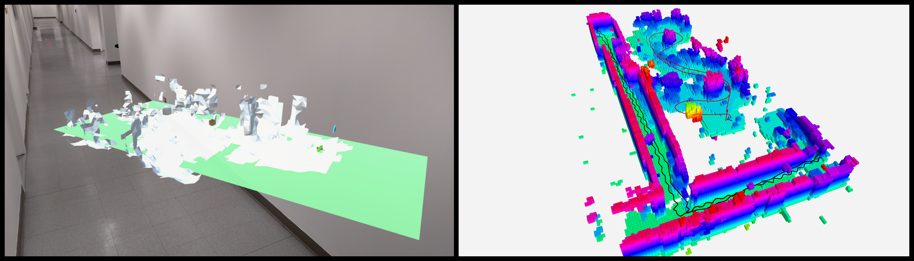
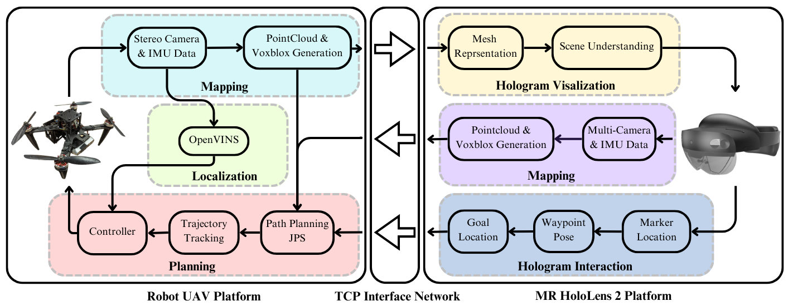

# Human Drone Interaction Joint Navigation

A Mixed Reality Framework for Human Drone Collaborative Exploration.

This repository contains the ROS code for the Human Robot Interaction IROS 2024 paper. The Unity code can be accessed through the following link: https://drive.google.com/file/d/1S4R8jkVfKLKn8YQGJedpOzbndGeRqUdM/view?usp=drive_link

## Overview
#### Description


This framework provide a spatially assisted human-drone collaborative exploration through immersive mixed reality. It incorporates novel human drone interaction modalities for a completed assisted navigation, and exploration in unknown environments. While operating the robot, the user can obtain visual mixed reality based spatial information from the drone, while assigning waypoints for the drone to follow. Furthermore, using the JPS path-planning algorithm, the drone can successfully navigate around obstacles should it encounter them while mapping the area. 

If you have any questions regarding the repo or how to use the framework please feel free to post questions in the Issues. 

**Developer: Pranav Nedunghat, Sanket Salunkhe, Luca Morando<br />
Affiliation: [NYU ARPL](https://wp.nyu.edu/arpl/)<br />
Maintainer: Luca Morando (lm4725@nyu.edu)<br />**

## ROS Organization
The ROS Organization and interface with Unity and the HoloLens is shown in the figure below.

The table below also summarized the publication and subscription scheme for the algorithm control pipeline.


**Topics**
| Topic                                               | Input / Output | Description                         |
|:----------------------------------------------------|:---------------|:------------------------------------|
| /basic_controls/feedback                            | Input          | Rviz Interactive Marker             |
| /keyboard_input/case_switcher                       | Input          | Take Control and change Yaw         |
| /obstacles_force_field                              | Input          | Force Acting on the robot from the obstacles |
| /planner/path                                       | Input          | Planner Computed Path               |
| /planner/start_assistive_guidance                   | Input          | Start APVI Mode                     |
| /planner/final_goal_reached                         | Input          | Stop  APVI Mode                     |
| /planner/final_goal                                 | Input          | Planner Final Goal Coordinates      |
| /planner/exit_search_mode                           | Output         | Stop Planner Execution              |
| /planner/path2D_to_unity                            | Output         | Publish the Waypoints to Unity      |
| /planner/exit_search_mode                           | Output         | Stop Planner Execution              |


The table below also summarized the publication and subscription scheme for the algorithm perception pipeline.
**Topics**
| Topic                                               | Input / Output | Description                         |
|:----------------------------------------------------|:---------------|:------------------------------------|
| /cloud_in_rep_                                      | Input          | Robot Pointcloud                    |
| /from_Unity/start_stop_mapping                      | Input          | Start Stop Mapping Command         |
| /from_Unity/restart_mapping                         | Input          | Restart mapping Command             |
| /voxblox_node/mesh                                  | Input          | List of Vertices and Indexes for the mesh     |
| /voxblox_node/surface_pointcloud                    | Input          | Octomap Pointcloud                   |
| /from_unity/mocap_frame_in_unity_world_coo          | Input          | TF Frame used in Unity (Cylinder in MR)             |
| /hololens_position                                  | Input          | Hololens Position     |
| /surface_mesh                                       | Output         |Organized Mesh for unity and Rviz Visualization     |
| /drone_mesh_to_unity                                | Output         |Drone Mesh Vertices as Pointcloud           |

## Dependencies and Installation
### ROS Dependencies
The HRI workspace packages are tested on `ROS Noetic`. Other dependencies we used are stated below:  

- Opencv 
- pcl msgs:  [PCL MSG](https://wiki.ros.org/pcl_msgs)<br />
- PCL :  [PCL ](https://wiki.ros.org/pcl_ros)<br />
- Cv Bridge:  [CV Bridge ](https://wiki.ros.org/cv_bridge)<br />
- Image transport:  [Image Transport](https://wiki.ros.org/image_transport)<br />
- OpenVINS: [OpenVINS](https://docs.openvins.com/)<br />
- Voxfield: [Voxfield](https://github.com/VIS4ROB-lab/voxfield.git)<br />


Our software, at least for preliminary test is also dependant by our custom made quadrotor simulator. Since it is a private repository we can not open source at the time, but the packages required to run the ARPL simulator are provided along with this repo as ROS executables.

To install the executables plese run the following commands inside the downloaded folder: 

```
chmod +x install_binary.sh 
./install_binary.sh 
```
All the binaries file will be installed in /opt/ros folder. 

After installation of necessary packages, clone the repo and `catkin build` the ROS workspace. Source the `setup.bash` file inside the devel folder.

```
$ cd /path/to/your/workspace/src
$ https://github.com/arplaboratory/human_drone_interaction.git
$ catkin build
$ source ~/path/to/your/workspace/devel/setup.bash
```
### Unity Dependencies
For the Unity code, we used Unity 2020.03 editor and Visual Studios 2020. The Unity code is available here: https://drive.google.com/file/d/1S4R8jkVfKLKn8YQGJedpOzbndGeRqUdM/view?usp=drive_link
In order to interface with ROS, you will need to install the ROS 1 plugin for Unity. Through the plugin, you can set the IP address of the robot or platform which is running the ROS packges. 


##  Running in Simulation
*Note:* Make sure the platfrom running the ROS packages and the one running the Unity packages are connected to the same network
### ROS
- Make sure the topic names are correct
- Launch the ARPL simulator
- Run the JPS package by using the command:
```
$ rosrun JPS JPS_Node 
```
- Run the ROS-TCP-Endpoint package using the command:
```
$ roslaunch ros_tcp_endpoint.launch tcp_ip:=<ip address of the robot/drone running the ROS packages> 
```
Run a bag_file containing a sample map generated by Voxblox or Voxfield, preferably a MarkerArray type message.
Once the ARPL simulator starts up, Press "Motors on" and "Take Off" to start the session. You should see the octomap from the rosbag in RVIZ
### Unity
Launch the simulation in the Unity editor after setting the ROS IP address. The simulator will start and should connect to the ROS platform. You can confirm this visually as the Unity editor will tell you when the connection was successfully made. 
Press `F` on your keyboard to lock the frame of ROS in the Unity editor. The smaller cube representing the drone/robot will turn orange.
Once launched select any button: Task 1 for single waypoint or Task 2 for multiple waypoints. The interactive marker will turn blue and you can drag the interactive marker around in the simulated environment to wherever you wish.
Once you are happy with the desired location, press `p` to publish the waypoints to the ROS side. The JPS Node will confirm that it has received the coordinates of the waypoints and it will print them out. You can then see the drone following the path generated by JPS, while avoiding obstacles.

##  Running in Real World
The provided code as been tested with our control pipeline (unfortunately not available) for the public installed on a custom drone built by our lab. 
To run on your custom quadrotor you need to adapt the control and the perception interfaces. 

Perception: 
- Our framework subscribe to a pointcloud message defined as sensor_msgs::PointCloud2. The standard name of the topic is /cloud_in but in case of necessity the topic can be remapped in the launch file Kimera_data.launch inside scene_understanding_pkg. 

Control: 
- Our framework needs an odometry topic as input (which can be remapped in the launch file Kimera_data.launch)
- The output is a position and a velocity command. An example of the custom message used is visible in  quadrotor_msgs/msg/PositionCommand.msg 


N.B. 
- To have a better experience in simulation, please download a rosbag with a preloaded map from [Here ](https://drive.google.com/drive/folders/1H3-JdphPuvJn6lQ2G43YSPgsMYo6cOqw?usp=drive_link)<br />. The rosbag needs to be stored in a folder called rosbag inside your ws. 
 
#### Unity Interaction with Rviz Visualization
In this scenario you can connect the Robot simulation to the application running on the Hololens. 


In this scenario you need to have a Microsoft Hololens 2, currently set up with Mixed Reality Toolkit and the repository (place the MR Unity repo) correctly build as MR application. 

The pipeline to correctly start the session is the following: 
- On the Hololens, navigate to the app menu and select "SceneUnderstandingROS". 
 

# Interaction in Mixed Reality
The user can choose to interact in a scenario loaded in a real scale or in miniaturized one called minimap. 
The user has to say "lock frame" to visualize the robot holograms change color from white to orange. 
Once the robot is flying, the user can pinch and drag the white interactive cube to move the robot around in the real world. 
If the Octomap is enabled, a mesh representing the discovered surfaces is build in the MR app while the robot is exploring the environment. 
The vocal commands to interact with the mixed reality are: 
- "Minimap": To view the drone mapped areas in a minimap format. 
- "Publish": To publish your waypoints to the drone/robot. 
- "Reset Map": To reset and re-start a new mapping session.
- "Update": To send the HoloLens pointcloud back to the station to compute the octomap. 

A full menu with all the available commands is available inside the application. 

#### Hololens Interaction in real world
In this option you need to be equipped with your platform. 
The pipeline, once properly adapted to ypur platform is similar to the one discussed in [Unity Interaction with Rviz Visualization]. 

